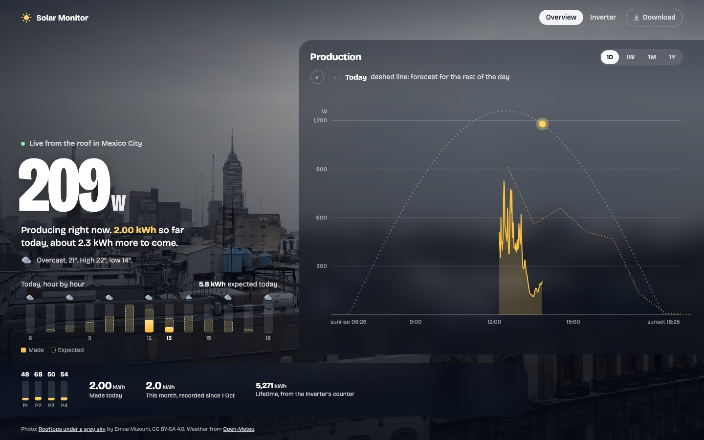

# Solar Monitor for Hoymiles microinverters

Watch a Hoymiles MI or HM microinverter live, keep its full history and see today's expected production,
without the Hoymiles cloud or an original DTU. An ESP32 next to the inverter talks to it over 2.4 GHz and
uploads every reading to a small server, which serves the website.



```
 inverter ──2.4 GHz (nRF24)──▶ ESP32 running AhoyDTU ──HTTPS──▶ server.py ──▶ website, history, CSV
                                  + SolarPush plugin               │
                                                                   └── Open-Meteo weather + expected output
```

What you get:

- **Overview**: live power, today's energy, an hour-by-hour bar chart of what the panels made against what the
  forecast expects, a production chart (day, week, month, year), each panel's output and CSV downloads.
- **Inverter page**: every value the inverter reports (voltages, currents, temperature, efficiency, per-panel data).
- **Background photos that follow the weather** (sunny, overcast, rain, storm, dusk, night).
- History in SQLite that survives DTU restarts and Wi-Fi drops.
- **Connection health**: the ESP32 reports its Wi-Fi signal, restarts and how often the inverter answers, so the
  site can tell you whether the Wi-Fi, the radio link or the power supply is the problem.

## What's in the repo

| Folder | |
|---|---|
| `server/` | The server: Python 3.9+, standard library only. API, SQLite history, website. |
| `firmware/ahoy/` | [AhoyDTU](https://github.com/lumapu/ahoy) 0.8.156 with two additions: the **SolarPush** upload plugin (`esp32-solar` build) and an **M5Stack Cardputer ADV** build with an on-screen display (`cardputer-adv`, see [CARDPUTER.md](firmware/ahoy/CARDPUTER.md)). |
| `firmware/nrf24-bench/` | A small ESP32 sketch for testing nRF24 modules: register probe, 2.4 GHz energy scan, constant carrier. |
| `firmware/cardputer-display/` | Turns an M5Stack Cardputer into a desk display for the website (live power, today vs forecast, panels, connection health). |
| `docs/ahoy-changes-vs-upstream.patch` | Every change made to AhoyDTU. |

## 1. Hardware

| Part | Notes |
|---|---|
| Hoymiles **MI** or **HM** inverter | MI serials `10x2…` and all HM models use the protocol this build speaks. MI 2nd gen (`10x0…`, `10x1…`) works with limits; see the AhoyDTU docs. HMS/HMT models need a CMT2300A radio instead. |
| ESP32 dev board (ESP-WROOM-32) | Any 38-pin board with a 3V3 pin. |
| **nRF24L01+** module | The plain module with the zig-zag PCB antenna is the safe choice. Some cheap **PA/LNA** modules with an SMA antenna pass every test but never get answers from the inverter, likely clone chips that handle acknowledgements differently. |
| 100 nF capacitor (optional) | Across the nRF24's VCC and GND, close to the module. |
| 0.96" SSD1306 OLED, I2C (optional) | Shows power, today's energy and Wi-Fi/radio status on the device itself: GND, VDD → 3V3, SCK → G22, SDA → G21. Handy for finding a good spot. |

Wiring (ESP32 ↔ nRF24). On the module, the pin with the square pad is GND.

| nRF24 | ESP32 |
|---|---|
| GND / VCC | GND / **3V3** (never 5 V) |
| CE / CSN | G4 / G5 |
| SCK / MOSI / MISO | G18 / G23 / G19 |
| IRQ | G16 |

Put the ESP32 within a few metres of the inverter, with a clear path to it and decent Wi-Fi, and power it from a
USB wall charger. Power banks often switch off at the ESP32's low current draw.

## 2. Server

Any Linux box with Python 3.9 or newer and a public HTTPS address works. You can also run it on a computer at
home and use plain `http://` on your local network.

```sh
sudo mkdir -p /opt/solar-monitor && sudo cp -r server/* /opt/solar-monitor/
cd /opt/solar-monitor
sudo cp config.example.json config.json            # then edit it, see below
echo "SOLAR_TOKEN=$(openssl rand -hex 24)" | sudo tee .env   # the upload password for the ESP32
sudo cp solar-monitor.service.example /etc/systemd/system/solar-monitor.service   # adjust User and paths
sudo systemctl enable --now solar-monitor          # listens on 127.0.0.1:8742
```

Then put a reverse proxy with HTTPS in front of port 8742 (nginx + certbot, or Caddy:
`caddy reverse-proxy --from solar.example.com --to 127.0.0.1:8742`). Without a domain, an address like
`solar.<your-ip>.sslip.io` works and can get a Let's Encrypt certificate.

`config.json`:

| Key | |
|---|---|
| `site_name`, `place` | Shown on the pages ("Live from the roof in …"). |
| `timezone` | IANA zone, for example `Europe/Madrid`. Days and charts use it, daylight saving included. |
| `latitude`, `longitude` | For the sun's path and the weather forecast. |
| `public_location_decimals` | The location is rounded to this many decimals before it reaches the browser or the weather service (1 ≈ 11 km, 2 ≈ 1 km). |
| `inverter` | `model`, number of `panels`, and `panel_max_w` (scales the panel bars). |
| `pv` | `tilt` and `azimuth` of the panels (0 = south, 90 = west, -90 = east), `peak_w` of all panels, `performance_ratio` (0.75 to 0.85 is typical) and `inverter_max_w`. Used for the expected production. |
| `photos` | Background photo per weather: `day`, `dusk`, `night`, `overcast`, `rain`, `storm`. Each has a `file` in `web/img/`, a CSS `position` and its credit (`title`, `author`, `license`, `source`). Any that are missing fall back to `day`. |

Environment (`.env`): `SOLAR_TOKEN` (required), `SOLAR_PORT` (8742), `SOLAR_DB` (path of the SQLite file),
`SOLAR_CONFIG` (path of `config.json`).

Try it locally first: `cd server && SOLAR_TOKEN=test python3 server.py` and open http://127.0.0.1:8742

## 3. ESP32 firmware

Install [PlatformIO](https://platformio.org/install/cli), then:

```sh
cd firmware/ahoy/src
export SOLAR_PUSH_URL=https://solar.example.com     # your server, no trailing slash
export SOLAR_PUSH_TOKEN=<the token from .env>
pio run -e esp32-solar -t upload                    # ESP32 on USB
```

On first boot the ESP32 opens the Wi-Fi network **AHOY-DTU** (password `esp_8266`). Join it, open
http://192.168.4.1, and:

1. Open **Settings**. Under **Network**, enter your Wi-Fi.
2. Under **Inverter**, add your inverter with the 12-digit serial printed on its label.
3. Under **System Config**, check the nRF24 pinout matches the wiring above (it's the default) and that the
   radio shows as connected after saving.
4. Set your timezone and location under **NTP Server** and **Sunrise & Sunset**.

Readings start arriving once the sun is up. The ESP32 queues them and keeps about 15 minutes' worth if Wi-Fi drops.
Later updates can go over Wi-Fi: build again and upload `.pio/build/esp32-solar/firmware.bin` from the AhoyDTU
**Update** page, or `curl -F "update=@.pio/build/esp32-solar/firmware.bin" http://<esp32-ip>/update`.

`esp32-solar` uses the `min_spiffs` partition layout to make room for HTTPS. If you change to it from another
AhoyDTU build, the first flash must be over USB and the settings are reset.

### Optional: Cardputer desk display

```sh
cd firmware/cardputer-display
export SOLAR_WIFI_SSID="your wifi" SOLAR_WIFI_PASS="..." SOLAR_URL=https://solar.example.com
pio run -t upload
```

The side button (G0) switches between live power and connection health; holding it changes the brightness.

Already running stock AhoyDTU? Skip the firmware and run `server/relay.py` on any always-on computer at home:
`SOLAR_URL=https://solar.example.com SOLAR_TOKEN=... python3 relay.py http://<dtu-ip>`.

## Troubleshooting the radio

AhoyDTU's `/api/system` shows `radioNrf.isconnected`. This build adds a few diagnostics:

| | |
|---|---|
| `radioNrf.probe` in `/api/system` | Raw register reads. All `00`: the module has no power or MISO is not connected. Must show `rd=A5` (a value written and read back). |
| `GET /api/rfscan`, then `radioNrf.scan` | Energy on all 126 channels. Your Wi-Fi should show up; zeros everywhere mean the receiver hears nothing. |
| `GET /api/cetest`, then `radioNrf.ceTest` | Checks that the CE wire actually controls transmission. |
| `radioNrf.resets` in `/api/system` | How often the nRF24 lost its settings (a power dip resets it to 2 Mbps and it stops hearing the inverter). The firmware checks every 5 s and reconfigures it; a count that keeps growing means the module's power supply is unstable. |
| `GET /api/carrier/<channel>` | Transmits a constant carrier for 20 s, then restarts. Combine with `firmware/nrf24-bench` on a second ESP32 to check the transmitter. |

If the radio passes all of these and the inverter still never answers, swap the nRF24 module before anything else.

## Licences

`server/` and `firmware/nrf24-bench/` are MIT licensed (see `LICENSE`). `firmware/ahoy/` is a fork of
[lumapu/ahoy](https://github.com/lumapu/ahoy) at commit `c4fe30f` and stays under its CC BY-NC-SA 4.0 licence
(`firmware/ahoy/LICENSE`): non-commercial use only. The background photos in `server/web/img/` are from Wikimedia
Commons under the CC licences listed in `server/config.example.json`. The pages show each photo's credit.
